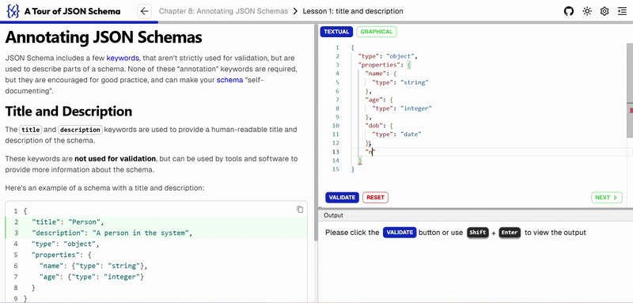

# Tour of JSON Schema

Welcome to the **Tour of JSON Schema** project! This repository hosts the codebase for an interactive learning platform designed to help users understand and master JSON Schema. You can access the live version of the project at [https://tour.json-schema.org](https://tour.json-schema.org).

---

## Table of Contents

- [Tour of JSON Schema](#tour-of-json-schema)
  - [Table of Contents](#table-of-contents)
  - [Development Setup](#development-setup)
    - [Prerequisites](#prerequisites)
    - [Installation](#installation)
    - [Figma Design](#figma-design)
    - [Contributing](#contributing)
  - [Content Creation](#content-creation)
    - [Writing MDX](#writing-mdx)
    - [VSCode Extensions](#vscode-extensions)
    - [File Structure](#file-structure)
  - [MDX Components Guide](#mdx-components-guide)
    - [GoodToKnowBox](#goodtoknowbox)
    - [CodeSnippet](#codesnippet)
    - [SideEditorLink](#sideeditorlink)

---

## Development Setup

The project is built using **Next.js**, a React framework for building server-rendered applications. Below are the steps to set up your development environment:

### Prerequisites

- **Node.js**: Ensure you have Node.js installed (v20 or higher).
- **pnpm**: The project uses `pnpm` as the package manager.

### Installation

1. Clone the repository:
   ```bash
   git clone https://github.com/json-schema-org/tour
   cd tour-of-json-schema
   ```

2. Install dependencies:
   ```bash
   pnpm install
   ```

3. Start the development server:
   ```bash
   pnpm dev
   ```

   > **Note**: Running `pnpm dev` will generate a file named `outline.json` in the `/content` directory. This file is used to dynamically generate the table of contents for the website.

4. Run tests before pushing changes:
   ```bash
   pnpm test
   ```
> [!CAUTION]
> Always run tests before submitting a pull request to ensure your changes do not introduce regressions.

### Demo


### Figma Design

You can view the Figma design for the project at [this link](https://www.figma.com/design/w8ow79jE7lJucJt2zZTbcz/Tour-of-JSON-Schema?node-id=2303-39&t=CH9j0oDmVft8uTWX-0).

### Contributing

Please Read the [Contributing Guide](CONTRIBUTING.md) for detailed instructions on how to contribute to the project.


---

## Content Creation

The content for the Tour of JSON Schema is written in **MDX**, a markdown format that supports JSX syntax. This allows us to embed React components directly into the documentation, making it highly interactive and engaging.

### Writing MDX

MDX combines the simplicity of Markdown with the power of React. Here are some resources to get started:
- [MDX Documentation](https://mdxjs.com/)
- [GitHub Markdown Guide](https://docs.github.com/en/get-started/writing-on-github/getting-started-with-writing-and-formatting-on-github/basic-writing-and-formatting-syntax)

### VSCode Extensions

For a smoother development experience, we recommend installing the following extensions in Visual Studio Code:

- **MDX**: Provides syntax highlighting and IntelliSense for MDX files.
  - Marketplace Link: [MDX Extension](https://marketplace.visualstudio.com/items?itemName=unifiedjs.vscode-mdx)
- **Prettier**: Automatically formats your MDX files on save.
  - Marketplace Link: [Prettier Extension](https://marketplace.visualstudio.com/items?itemName=esbenp.prettier-vscode)

### File Structure

The content is organized in the `/content` directory with the following structure:

```
├── 01-introduction
│   ├── index.mdx                # Overview of the section
│   ├── 01-welcome
│       ├── instructions.mdx     # Instructions for the step
│       ├── code.ts              # Template code and validation logic
│   ├── 02-what-is-json-schema
│       ├── instructions.mdx
│       ├── code.ts
├── 02-types
│   ├── index.mdx
│   ├── 01-primitive-types
│       ├── instructions.mdx
│       ├── code.ts
│   ├── 02-arrays
│       ├── instructions.mdx
│       ├── code.ts
```

- Each section (e.g., `01-introduction`) has an `index.mdx` file that serves as an overview.
- Each step within a section contains:
  - `instructions.mdx`: The content displayed to the user.
  - `code.ts`: Contains template code and logic to validate user-provided schemas.

---

## MDX Components Guide

The project includes custom React components to enhance the interactivity and readability of the content. Below is a guide to the available components:

### GoodToKnowBox

A styled box for displaying tips, notes, or additional information.

**Props:**
- `title` (optional): The title of the box. Defaults to "Good to know".
- `children`: The content of the box.

**Example:**
```md
<GoodToKnowBox title="Pro Tip">
  Use `$ref` to reuse schema definitions and keep your JSON Schema DRY.
</GoodToKnowBox>
```

---

### CodeSnippet

A code block with syntax highlighting and optional line highlighting.

**Props:**
- `highlightLineStart`: The starting line number to highlight.
- `highlightLineEnd` (optional): The ending line number to highlight. Defaults to `highlightLineStart`.
- `startingLineNumber` (optional): The starting line number for the code block. Defaults to `1`.
- `showLineNumbers` (optional): Whether to display line numbers. Defaults to `true`.

**Example:**
```md
<CodeSnippet highlightLineStart={3} highlightLineEnd={5}>
{
  "type": "object",
  "properties": {
    "name": { "type": "string" },
    "age": { "type": "integer" }
  }
}
</CodeSnippet>
```

---

### SideEditorLink

A link that focuses the editor on the right side of the screen.

**Props:**
- `text` (optional): Custom text for the link. Defaults to "side editor".

**Example:**
```md
<SideEditorLink text="Open the editor to try this example" />
```
---

Thank you for contributing to the **Tour of JSON Schema** project! Together, we can make JSON Schema more accessible and easier to learn for everyone.